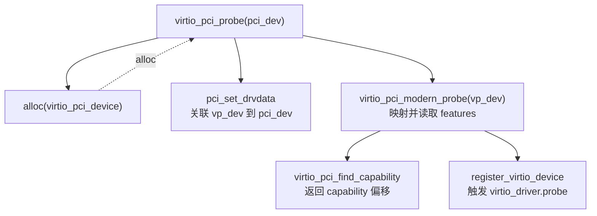
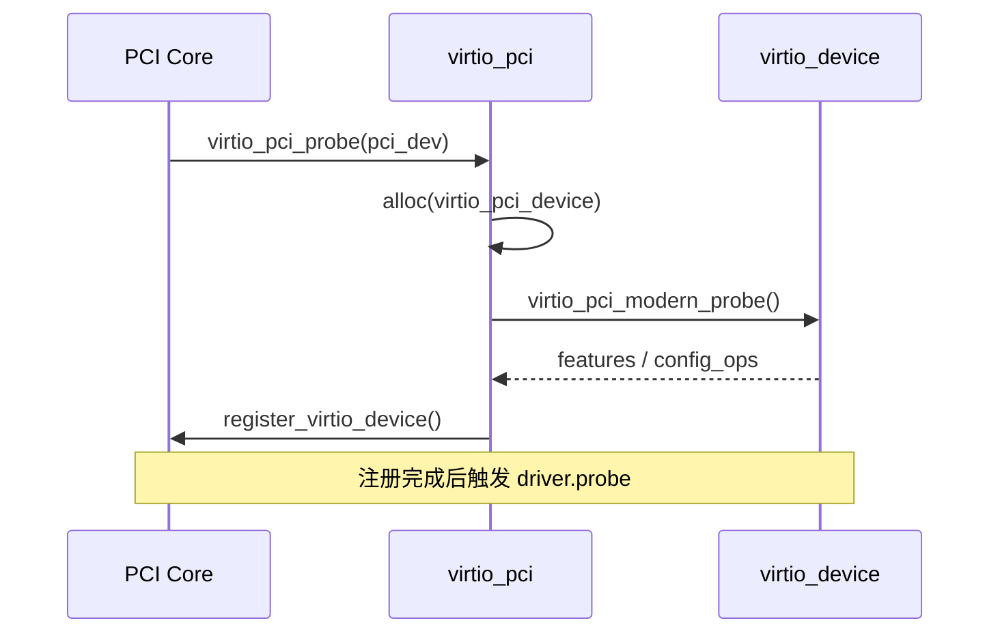
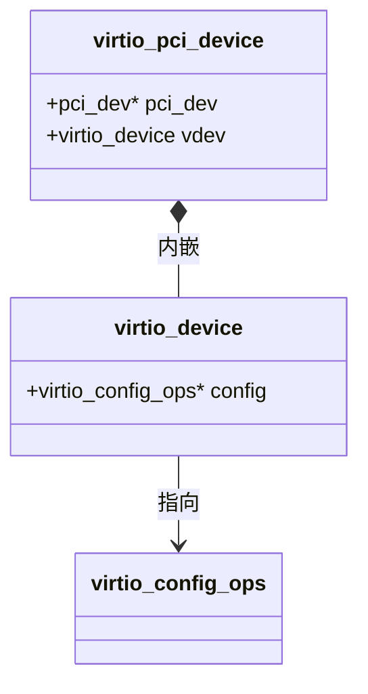
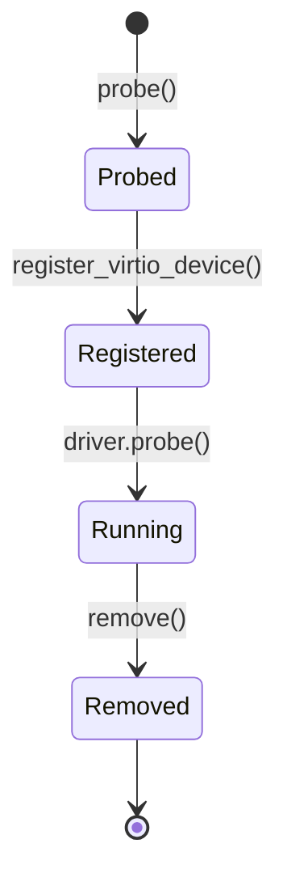
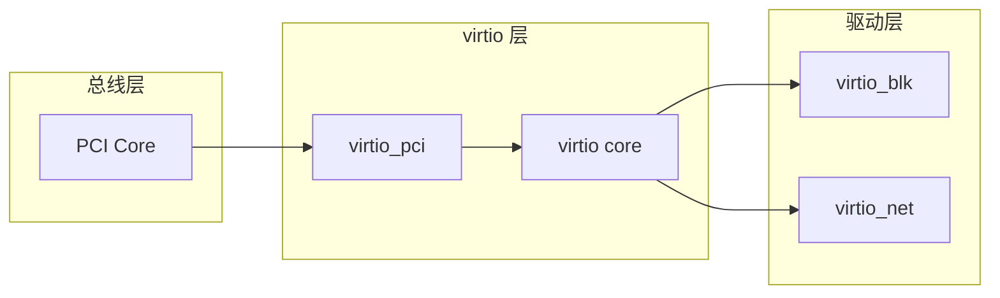

# Mermaid 图示速查

analyzer 报告中的图示**优先用 mermaid**（流程图、调用图、时序图、状态机、依赖图等），
以便在 GitHub、VS Code、Typora 等现代 markdown 渲染器中直接渲染成图。
需要逐行 `//` 注释的密集调用追踪，仍可用缩进字符树作为补充（见末节）。

## 何时用哪种图

| 分析对象 | 首选图类型 | mermaid 关键字 |
| --- | --- | --- |
| 调用图 / 控制流 / 分支 | 流程图 | `flowchart TD` / `flowchart LR` |
| 调用时序 / 消息往返 / 跨组件交互 | 时序图 | `sequenceDiagram` |
| 类型关系 / 继承 / 组合 / 结构体字段 | 类图 | `classDiagram` |
| 状态机 / 对象生命周期 | 状态图 | `stateDiagram-v2` |
| 数据模型 / 表关系 | ER 图 | `erDiagram` |
| 模块 / 包依赖 | 流程图 + 分组 | `flowchart` + `subgraph` |

## 各图最小示例

### 调用图 / 控制流（flowchart）

把「谁调用谁」画成有向图；用节点文字承载原来的 `// 注释`，用带标签的边表达
分配 / 返回等关系（对应字符树里的 `<--- alloc`）。



### 调用时序 / 交互（sequenceDiagram）

强调「时间上的先后」和「跨组件的消息往返」，适合探针注册、请求处理、锁获取释放等。



### 类型 / 结构关系（classDiagram）



### 状态机 / 生命周期（stateDiagram-v2）



### 模块 / 包依赖（flowchart + subgraph）



## 实用技巧

- **分组**：`subgraph 名称[显示标题] ... end` 把节点按层/模块聚拢。
- **节点内换行**：用 `<br/>`，把原字符树的 `// 注释` 放进节点第二行。
- **带标签的边**：`A -- "alloc" --> B`（实线）或 `A -. "回填" .-> B`（虚线），
  表达分配、返回、回调等关系。
- **方向**：`TD`（上到下，适合调用树）、`LR`（左到右，适合依赖/流水线）。
- **强调节点**：`classDef hot fill:#f88;` 再 `class A,B hot;` 标出热点/风险节点。

## 渲染兼容性注意

- mermaid 必须写在独立的 ` ```mermaid ` 围栏里，**围栏前后各留一个空行**
  （与本 skill 对表格前后留空行的要求一致）。
- 部分渲染器（纯文本终端、老旧阅读器）**不支持 mermaid**，会原样显示源码。
  对关键图，在 mermaid 块附近保留一句文字概述或一段字符树，保证降级后仍可读。
- 节点文字含 `()`、`:`、`<>`、`,` 等特殊字符时，用**双引号包裹**整段文字，
  例如 `A["foo(bar): baz"]`，否则可能解析失败。
- 保持图精简（一屏内）。图太大时拆成多张：一张总览 + 若干局部放大。

## 何时回退到字符缩进树

需要**逐行对齐、密集 `//` 行内注释**的调用追踪时，字符缩进树仍是首选——
它能在一处同时呈现调用层级、每一行的注释和数据流向，信息密度高于 mermaid。
典型形态：

```
virtio_pci_probe(pci_dev)                              // pci_device 结构体
  vp_dev = alloc(virtio_pci_device) <------------------ alloc virtio_pci_device
  pci_set_drvdata(pci_dev, vp_dev)                     // 关联 vp_dev 到 driver_data
  virtio_pci_modern_probe(vp_dev)                      // 映射并读取 features
    virtio_pci_find_capability                         // 返回 capability 偏移
  register_virtio_device(&vp_dev->vdev)                // 触发 virtio_driver.probe
```

经验法则：**框架用 mermaid，逐行细节用字符树**。两者可在同一份报告里配合使用。
