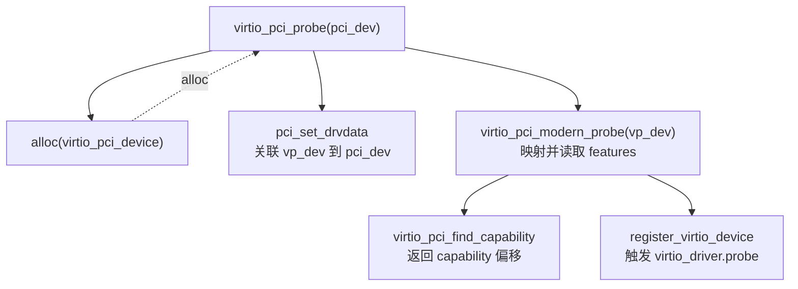

# 分析报告模板

新建报告时复制此结构。**元信息**中的每一项都要填；若某值未知，写明原因（例如「非 git 仓库」），不要留空。

---

# 分析报告：<仓库名> — <分析范围 / 主题>

## 元信息
- **仓库**：<origin 的 `git remote -v` 输出，例如 `git@github.com:org/repo.git`>
- **请求的 ref**：<用户要求分析的分支 / tag / commit，或「当前工作树」>
- **实际分析的 ref**：<分支名> / <`git describe --tags` 的 tag> / <`git rev-parse HEAD` 的 commit 哈希>
- **分析时工作树所在分支**：<当前分支> <若与实际分析的 ref 不同，在此注明>
- **读取方式**：<「工作树」 | 「针对 <ref> 使用 git show/git ls-tree 读取（工作树未改动）」>
- **分析范围**：<整个仓库 | 模块路径，如 `pkg/scheduler` | 模块的某方面，如「scheduler 的并发安全」>
- **关注方面**：<如 并发 / 安全 / 性能 / 错误处理 / 可维护性；若为整体概览则写「整体」>
- **分析日期**：<YYYY-MM-DD>
- **分析者**：Claude Code

## 范围
<本报告覆盖什么、不覆盖什么。范围层级（仓库/模块/方面）、目标路径、关注点。一两句话。范围在后续交互中变化时更新此处，并在分析日志记一笔。>

## 摘要 / 关键发现
<动态维护的一节。把最重要的结论放在这里，随分析加深而更新。>
- 发现 1 —— ...
- 发现 2 —— ...

## 架构 / 笔记（可选）
<图示、模块地图、数据流笔记，或其他值得长期保留的上下文。>

**图示优先用 mermaid**（流程图、调用图、时序图、状态机、依赖图等），以便在 GitHub /
VS Code / Typora 等渲染器中直接渲染成图。图类型选择、各图示例与渲染注意事项见
`references/mermaid-cheatsheet.md`。

如果涉及调用路径，首选把它画成 mermaid 流程图（框架）或时序图（交互先后）：



当需要**逐行 `//` 注释的密集调用追踪**时，缩进字符树作为补充仍然好用
（信息密度高，能同时呈现层级、注释与数据流）：

```
virtio_pci_probe(pci_dev)                              // pci_device结构体
  vp_dev = alloc(s virtio_pci_device) <-------------------------------------------------------- alloc virtio_pci_device
  pci_set_drvdata(pci_dev, vp_dev)                     // 将virtio_pci_device关联到pci_device->device->driver_data中
    pci_dev->dev->driver_data = vp_dev
  vp_dev->pci_dev = pci_dev                            // 将pci_device关联到virtio_pci_device中
  pci_enable_device(pci_dev)
  virtio_pci_modern_probe(vp_dev)                      // 映射、读取virtio pci设备在bar空间中的各种features
    virtio_pci_find_capability                         // 返回各种capability链表结构在配置空间中的偏移
      pci_find_capability
        __pci_bus_find_cap_start
        __pci_find_next_cap
    map_capability
    virtio_pci_device.virtio_device.config = virtio_pci_config_ops
  register_virtio_device(&vp_dev->vdev)                // 注册struct virtio_device
    trigger virtio_driver.probe
```

请注意，如果要求结合源码分析，则尽量结合代码调用图来解释。可以代码框架用调用图，细节单独拎出来讲。
- 用代码调用图的意图是让看报告的人有一个清晰的逻辑框架。如果直接讲细节，很容易迷失。切记！

经验法则：**框架用 mermaid，逐行细节用字符树**，两者可在同一份报告里配合使用。
代码调用图可以按照你的方式来美化，但调用流程一定要留。

## 分析日志
<按时间顺序。每个不同的问题一条。只追加；除纠错外不改写过往条目。>

### Q1：<对问题的清晰复述>
**提问于：** <YYYY-MM-DD>

**回答：**
<发现。代码引用形如 `路径/文件.扩展名:行号`。附上简短、相关的代码片段。>

```language
// 来自 路径/文件.扩展名:NN 的相关片段
```

**结论：** <对该问题的直接回答>

---

### Q2：<下一个问题>
**提问于：** <YYYY-MM-DD>

**回答：**
...

## 待解问题 / TODO（可选）
- <尚未解决、留待后续交互回头处理的事项。>
